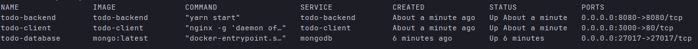
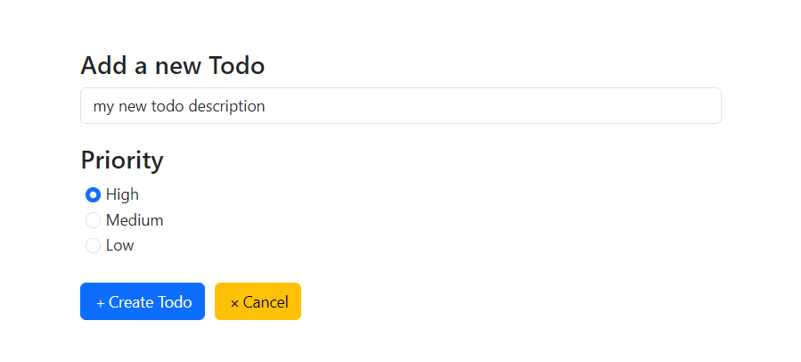
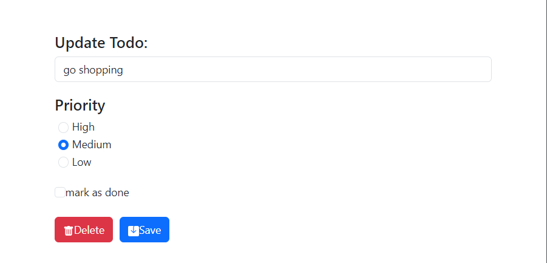
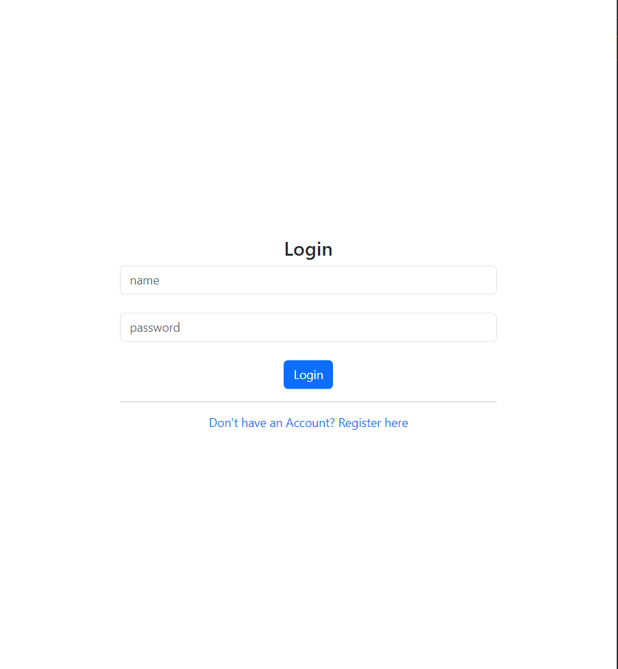
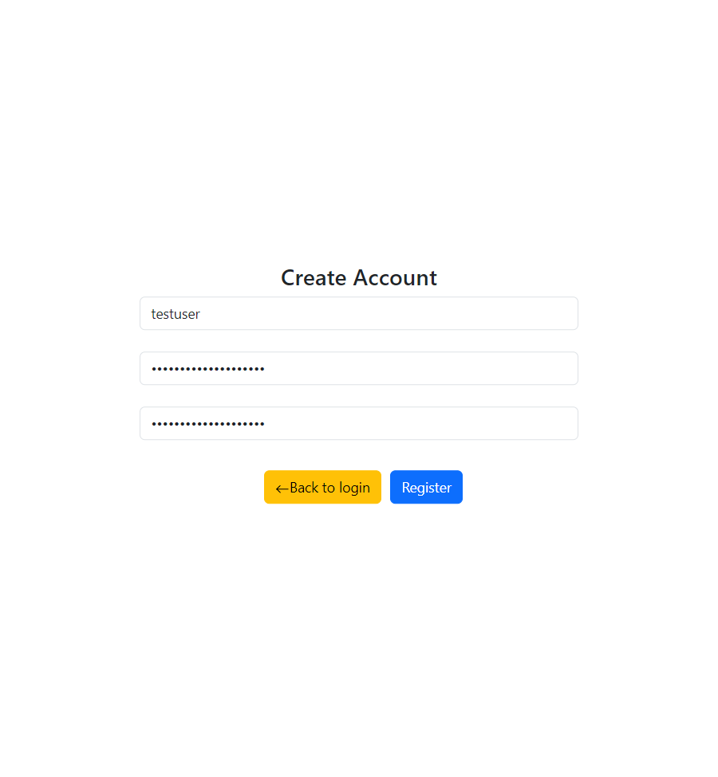

# MERN-Todo-App 
Todo List Application using MERN Stack (MongoDB, Express.js, React, Node.js) and bootstrap with Typescript React. The Application also uses password hashing and salting for the user accounts by using <a href="https://www.npmjs.com/package/bcryptjs">bcryptjs</a>. 

⚠️ as this is only a demo Application, login data will not be saved. When reloading the browser you have to log in again. maybe in future releases this feature is also available.


## Getting started

ℹ️ This Application runs on all common platforms: macOS, Windows 10/11, Linux (tested on Ubuntu 22.04 LTS)

You can either run this application by setting up your local MongoDB database, or you can run the Application
with Docker Compose 

### 🖥️ Run Application Locally

#### Step 1 - Setting up Database
First you need to install MongoDB, I recommend also to install MongoDB Compass.
- <a href="https://www.mongodb.com/try/download/compass">MongoDB Compass Download Link</a>
- <a href="https://www.mongodb.com/try/download/community">MongoDB Download</a>

- After you installed MongoDB run the local Database <a href="https://www.mongodb.com/basics/get-started">here you can find how to get started with mongoDB</a>
- Setting up Database
  - create a new db called ``todo``
  - in this db create two new collections called ``todos`` and ``users``

#### Step 2 - Setting up Backend
- run in the directory ``todo-backend`` **yarn install**
- edit the /todo-backend/.env: paste into the ``SERVICE_IP_ADDRESS`` field the value ``localhost``
- after installing all dependencies you can run the server with ``yarn start`` or with the development mode ``yarn dev``

#### Step 3 - Setting up Frontend
- run in the directory ``todo-client`` **yarn install**
- edit ``/todo-client/services/loginService`` and ``/todo-client/services/todosService`` and replace 
  the base url ``http://todo-backend:8080/`` with ``http://localhost:8080/``
- after installing all dependencies you can run the frontend with ``yarn serve``
- **(optional)** you can generate a production build of the Application with ``yarn build``

Now you are Ready to use the Application 🎉

- <a href="https://github.com/d4niee/MERN-Todo-App/blob/main/todo-client/README.md">how to start the frontend</a>
- <a href="https://github.com/d4niee/MERN-Todo-App/blob/main/todo-backend/README.md">how to start the backend</a>

### 🐋 Run Application with Docker (recommend)

⚠️ Make sure you have Docker installed and running on your Machine. <a href="https://docs.docker.com/desktop/">Here you can find an Installation Link</a>

in the root directory of the project run 
```shell
docker-compose up -d --build
```

After the build process you can view the compose with
```shell
docker-compose ps
```
It should look similar to the following screenshot:


You can now open the Application with 
<a href="http://localhost:3000">**http://localhost:3000**</a>

## Screenshots

Create a new Todo


Edit an existing Todo


Login Page



Register Page



<hr/>

If you find any errors or have any other suggestions for improvements i am happy about feedback! :)
